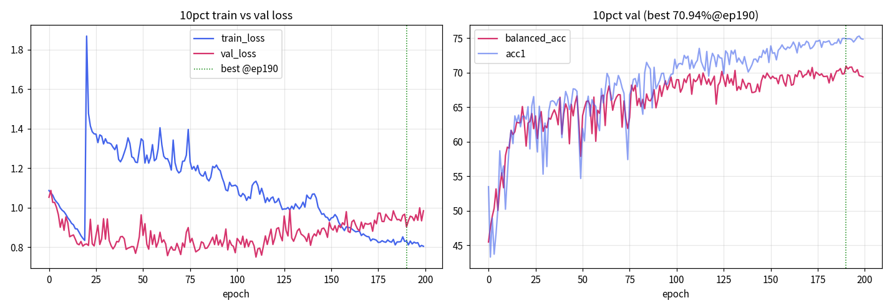

# ProtoPFormer-Study

[](https://arxiv.org/abs/2208.10431)
[](https://github.com/zju-vipa/ProtoPFormer)

ProtoPFormer adds **Global + Local prototype branches** on top of DeiT, giving
**intrinsic interpretability** ("this looks like that") for fine-grained recognition.
This study repo extends the team's fine-grained pool from **post-hoc attention**
(TransFG / PIM / RA-CNN) to **intrinsic prototype reasoning**, then transfers to the
**Bogonet industrial dataset (Phase 2, private)**.

## 👁️ Project Goal
Make each prediction **auditable** — the model points to the image region (prototype)
behind its decision. Target: safety-critical industrial inspection where *why* matters.

## 🚀 Objective
```
ImageNet (DeiT-S/16)  →  Bogonet 3-class domain transfer (our own train/val split)  →  interpretable classifier
```

This branch (**SCRUM-52**) delivers the **10pct crop expansion** full run (200 epochs) + result artifacts.
Sibling tickets: SCRUM-48 (25pct), SCRUM-56 (0pct) for the 3-way crop ablation.

---

## 1. Setup (Python 3.12 · uv)

Reproducible environment via [uv](https://docs.astral.sh/uv/):

```bash
# 1) install uv (once per machine)
curl -LsSf https://astral.sh/uv/install.sh | sh

# 2) reproduce the exact environment (creates .venv from uv.lock)
uv sync

# 3) run anything inside that environment
uv run python main.py ...
```

- **Python**: `3.12` — pinned via `.python-version`
- **PyTorch**: `torch==2.10.0+cu130`, `torchvision==0.25.0+cu130` from the PyTorch **CUDA 13.0** index
  (declared in `pyproject.toml [tool.uv.sources]`, so `uv sync` fetches the correct aarch64 wheels)
- **Hardware (dev)**: NVIDIA GB10 (DGX Spark, aarch64, CUDA 13.0)
- Exact versions are frozen in **`uv.lock`** (committed) → identical env for every teammate.

> ℹ️ Scripts/identifiers use the `bogonet` name throughout.

---

## 2. 🏋️ Training (this branch: crop=10pct)

```bash
# bash scripts/train_bogonet.sh <batch> <epochs> <expansion>  [resume_ckpt]
uv run bash scripts/train_bogonet.sh 64 150 10pct                                    # 1차 150ep
uv run bash scripts/train_bogonet.sh 64 200 10pct <checkpoint-latest>                # 200ep까지 resume
```
- **Class imbalance** → `--balanced_sampler` (WeightedRandomSampler, train loader only)
- Cosine schedule + warmup; **best checkpoint selected by balanced accuracy**
- 25pct/0pct는 200ep 단번에 학습, 10pct는 공정 비교 위해 150 → resume +50ep = 200ep
- Full hyperparameters → [`result/10pct/parameters.md`](result/10pct/parameters.md)

## 3. 📊 Result — 10pct crop, 200 epochs

Headline metric = **balanced accuracy** (mean per-class recall — the meaningful metric under imbalance), plus per-class **precision / recall / F1** and a **confusion matrix**.

| metric | value |
| :--- | :--- |
| balanced accuracy (best) | **70.94%** |
| per-class recall (cut / danger / excluded) | 0.82 / 0.70 / 0.61 |
| per-class precision (cut / danger / excluded) | 0.80 / 0.68 / 0.71 |
| per-class F1 (cut / danger / excluded) | 0.81 / 0.69 / 0.66 |

**Crop-expansion ablation outlook** (same split02, 200 epochs):

| crop | balanced acc | ticket |
| :--- | ---: | :--- |
| 25pct | 73.16% | SCRUM-48 |
| **10pct** (this branch) | **70.94%** | SCRUM-52 |
| 0pct  | 71.59% | SCRUM-56 |

→ ProtoPFormer crop 패턴 = **25 > 0 > 10 (비단조)**. tight crop(0pct)에도 강건하고, 중간값 10pct가 의외의 최저. local prototype 매칭이 spatial location에 덜 민감한 결과.

**Train/Val overfit check (10pct):**



Full artifacts in this branch: [`result/10pct/`](result/10pct/) — `metrics.md` (P/R/F1+confusion), `parameters.md` (hyperparams), `train_val_history.md` + `overfit_curve.png` (overfit check).

## 4. 🔥 Prototype Visualization ★ (core deliverable)

```bash
uv run bash scripts/visualize_bogonet.sh epoch-best.pth
```
Generates per-prototype **activation heatmaps**: *which patch matched which class prototype*,
making each decision auditable.

> "Why was this sample classified as class X?" → "Patch Y matches prototype P_k of class X."

*(Sample images are omitted here — private dataset.)*

## 5. 📈 Output & Metrics layout

```
output/.../checkpoints/epoch-best.pth        # best by balanced_acc
output/.../checkpoints/checkpoint-latest.pth # per-epoch, for --resume
output/.../tf-logs/                          # TensorBoard scalars
output/.../train-logs/                       # text log (per-epoch metrics, confusion matrix)
```

---

## 🔧 Modifications from Original

| Area | Change | Why |
| :--- | :--- | :--- |
| timm 1.0 compat | pop meta kwargs in `MyVisionTransformer`; optional CaiT import | run on timm 1.0 |
| Class imbalance | `--balanced_sampler` (WeightedRandomSampler) | minority classes |
| Metric | balanced accuracy + per-class confusion matrix | imbalanced eval |
| Checkpointing | best = balanced_acc; per-epoch `checkpoint-latest` (resume) | recall-first / robust long runs |
| Crop ablation | `--expansion` arg (0 / 10 / 25 %) | context-vs-tightness study |
| torch 2.6 / mpl 3.4 | `torch.load(weights_only=False)`; `fig.add_subplot(projection='3d')` | visualization on current stack |
| Hardware | NVIDIA GB10 / aarch64 / CUDA 13 single-GPU path | dev machine |

## ♻️ Reproducibility Policy

Any teammate should read this README, run the committed files as-is (`uv sync` → `uv run ...`),
and obtain the same result. Fixed seed (1028); environment frozen in `uv.lock`; results recorded above;
no aspirational commands.

## Citation

```bibtex
@inproceedings{xue2022protopformer,
  title={ProtoPFormer: Concentrating on Prototypical Parts in Vision Transformers for Interpretable Image Recognition},
  author={Xue, Mengqi and Huang, Qihan and Zhang, Haofei and Cheng, Lechao and Song, Jie and Wu, Minghui and Song, Mingli},
  booktitle={ECCV},
  year={2022}
}
```

### Acknowledgement
- Official ProtoPFormer implementation: [zju-vipa/ProtoPFormer](https://github.com/zju-vipa/ProtoPFormer)
- Team fine-grained research track: [Forge-AI-Core](https://github.com/Forge-AI-Core)
