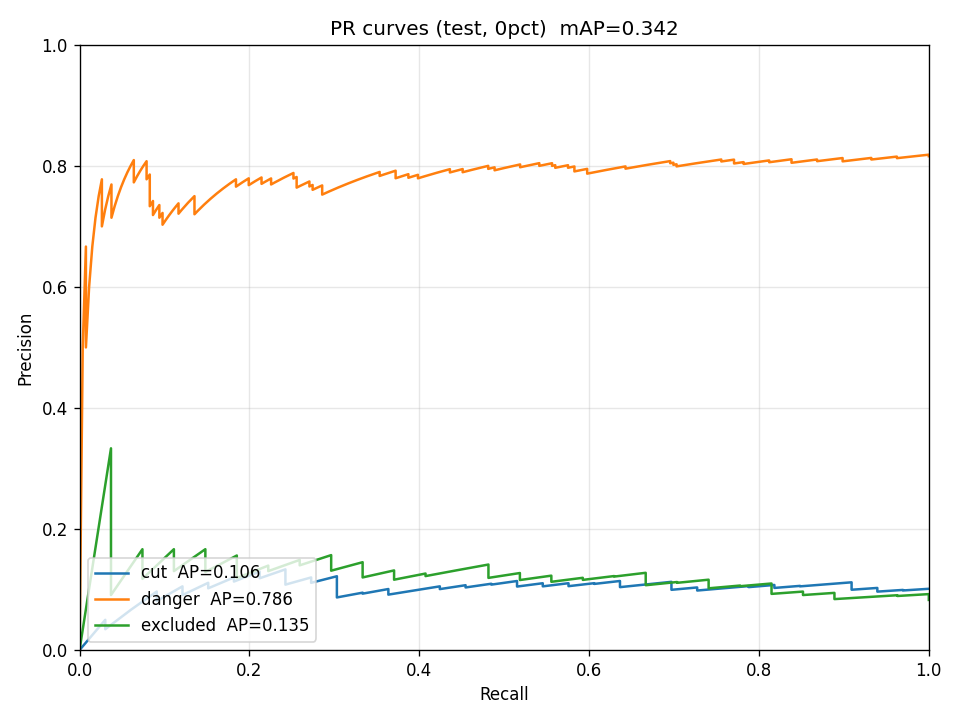
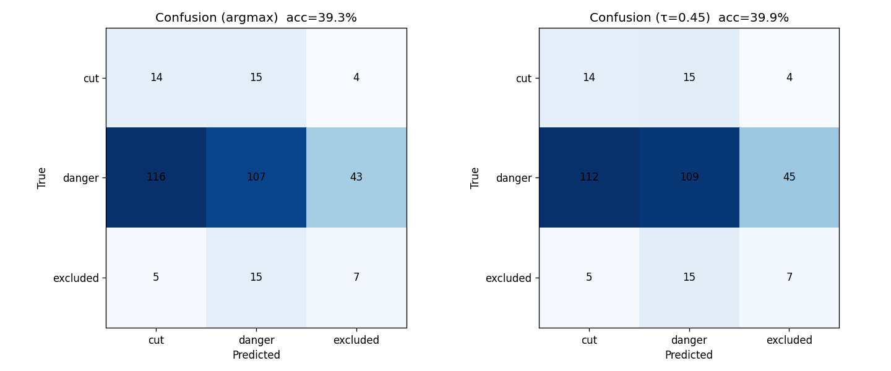

# Test Eval — ProtoPFormer-Study 0pct crop

- Checkpoint: `/home/changilkim/Documents/aiffel_class/ProtoPFormer/output/bogonet_0pct/Bogonet/deit_small_patch16_224/1028-adamw-0.05-200-protopformer/checkpoints/epoch-best.pth`
- Val set    : split02 val (3369 장)
- Test set   : `testset/crops_0pct` (326 장)
- Test class counts (cut/danger/excluded): [33, 266, 27]  (※ danger 압도)

## Validation 에서 결정한 τ*

- **τ\* = 0.45** (val balanced_acc 최대)
- 규칙: `P(danger) ≥ τ → danger; 아니면 argmax({cut, excluded})`
- Val balanced_acc(τ\*) = 0.7156
- 참고 — F-beta(0.5) 최대 τ = 0.80, fbeta=0.7026

(threshold sweep 전체: [`threshold_sweep.md`](threshold_sweep.md))

## Test 결과 — A. argmax

| class | precision | recall | f1 | support |
|---|---:|---:|---:|---:|
| cut      |  10.37 |  42.42 |  16.67 |    33 |
| danger   |  78.10 |  40.23 |  53.10 |   266 |
| excluded |  12.96 |  25.93 |  17.28 |    27 |

- Accuracy = **39.26%**
- Balanced acc = **36.19%**

### Confusion matrix (argmax)
```
              cut  danger  excluded
  cut         14     15        4
  danger     116    107       43
  excluded     5     15        7
```

## Test 결과 — B. τ\*=0.45 적용

| class | precision | recall | f1 | support |
|---|---:|---:|---:|---:|
| cut      |  10.69 |  42.42 |  17.07 |    33 |
| danger   |  78.42 |  40.98 |  53.83 |   266 |
| excluded |  12.50 |  25.93 |  16.87 |    27 |

- Accuracy = **39.88%**
- Balanced acc = **36.44%**

### Confusion matrix (τ\* 적용)
```
              cut  danger  excluded
  cut         14     15        4
  danger     112    109       45
  excluded     5     15        7
```

## PR Curve (one-vs-rest, test)

| class | AP |
|---|---:|
| cut | 0.1061 |
| danger | 0.7862 |
| excluded | 0.1347 |
| **mean AP** | **0.3423** |



## Confusion Matrix


